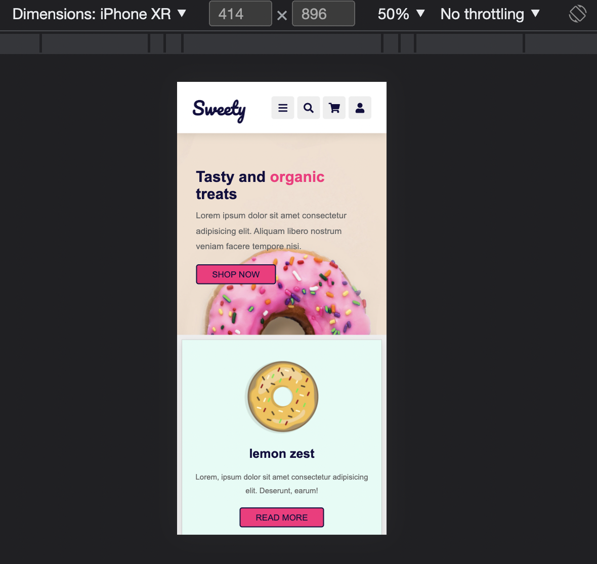
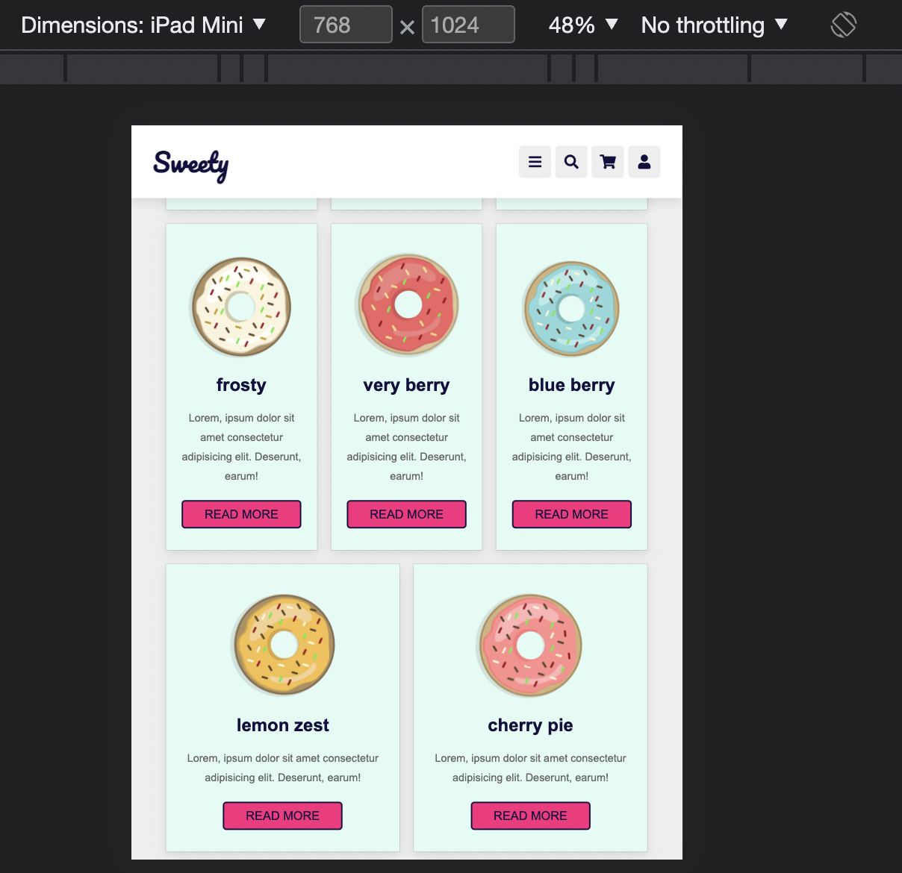
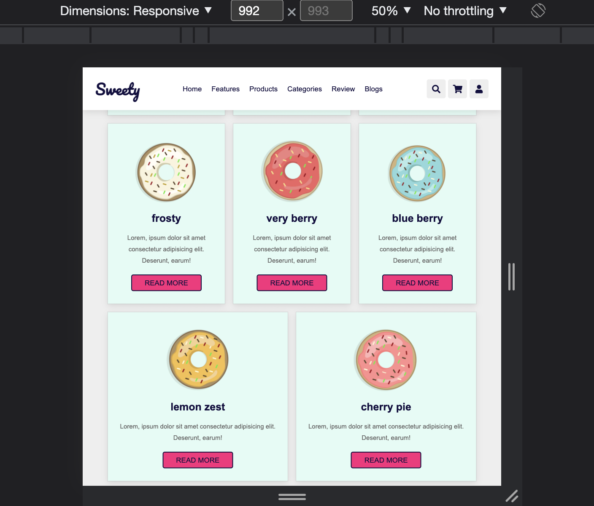

# UIB-sweety-layout

- Take a look at the screenshots in the design folder
- Create a responsive page based on the screenshots using flex and media queries

Notice: 
- The navigation should be always visible on all devices, no matter  how much content is in the main section. 
- Menu links should have a deep pink underline on hover
- Icons should have a deep pink background on hover

## Mobile

## Tablet

## Desktop

## Extra

